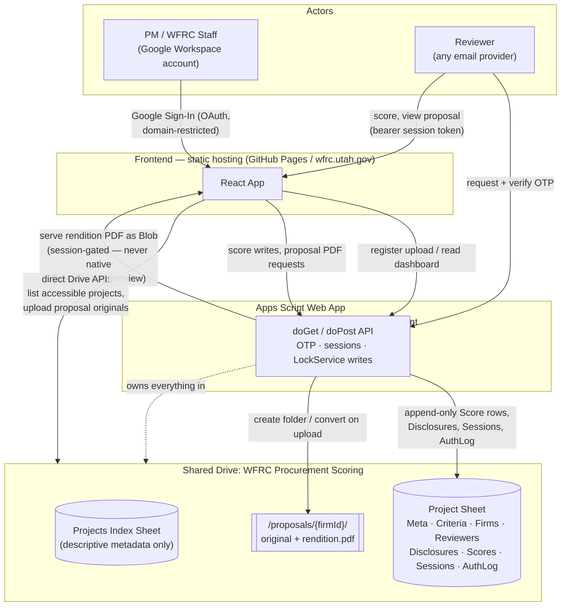

# Pipeline: Backend-Enabled Workflow (Draft)

**Status**: Discussion draft, not implemented, not yet a commitment. This document exists to
align on the target workflow (Part 1) before designing the technical architecture that
supports it (Part 2). It directly supersedes the "Possible future direction" section of
`README.md` and, if adopted, requires an explicit amendment to
`.specify/memory/constitution.md` (Principles I, II, IV, IX all currently forbid this) —
that amendment is deliberately not made yet; this doc is the design work that has to happen
first.

Terminology below matches the existing data model
(`specs/001-consultant-selection-scoring/data-model.md`): **Firm** = a consultant/proposer,
**Reviewer** = someone scoring firms (`type: "applicant" | "wfrc"`), **Criterion** =
a weighted scoring category, **Score** = one reviewer's rating of one firm on one criterion.

---

## Architecture Summary

Three layers, two identities that never cross:

- **Frontend** — the existing React app (static hosting: GitHub Pages / wfrc.utah.gov),
  extended with sign-in, an in-app document viewer, and in-app scoring.
- **Backend** — a single Google Apps Script Web App deployment, running as one dedicated
  WFRC service account. It's the only thing that ever talks to Drive/Sheets on a reviewer's
  behalf.
- **Storage** — one Shared Drive (org-owned, not tied to any individual account) holding a
  central Projects Index plus one Sheet + Drive folder per project. Proposals are stored as
  both the untouched original and a normalized PDF rendition.

**Staff/PM** carry a real WFRC Google Workspace identity straight through: Google Sign-In,
direct Drive API access, multi-project visibility derived live from Drive folder sharing —
no parallel permission system. **Reviewers** are assumed to have no org identity at all: a
custom OTP+session scoped to exactly one project, with no code path that can see any other
project. Every design choice below Part 2 traces back to keeping that split clean rather than
blurring the two into one auth system.



Full stage-by-stage workflow (Part 1) and the reasoning behind every box above (Part 2)
follow below.

---

## Part 1: Target Workflow

### Roles

| Role | Who | Google identity? |
|---|---|---|
| **Project Manager (PM)** | WFRC staff running the procurement | Has a WFRC Google Workspace account (utah.gov) |
| **Reviewer** | Scores firms — TLC Applicant or WFRC staff | May or may not have any Google account (Microsoft 365, personal email, etc. all possible) |
| **Firm** | The consultant being scored | Not a system actor — never signs in, never touches the app |

### Stage-by-stage

**1. Project setup (PM)**
- PM starts a new project in the app: project info, firms (invited/submitted), criteria +
  weights, scoring scale — same configuration model as today.
- The app creates the project's Drive folder itself (not the PM manually creating/pointing
  at one) — named/keyed from the project so later automated file detection and indexing have
  a predictable structure to rely on, instead of the app having to cope with however each PM
  happens to have organized their own folder. *(Part 2: exact folder naming/keying scheme.)*
- PM adds reviewers (name, email, type) directly in the app, as today — this becomes the
  reviewer roster used for invitations, not just a label.

**2. RFP/proposal documents (PM)**
- PM uploads proposal documents **through the app** (the default and priority path) rather
  than dropping files into Drive directly — uploading through the app lets the app rename/
  key each file consistently (e.g. tie it to a specific firm) for reliable indexing, instead
  of requiring every PM to hand-standardize filenames or the app carrying complex
  best-effort detection logic to guess which file belongs to which firm.
  *(Part 2: exact naming convention, and whether direct-to-Drive upload is ever supported as
  a fallback for large files.)*

**3. Reviewer invitation (System → Reviewer)**
- For each reviewer on the roster, the system sends an invitation email containing a link
  into the app (not into Drive directly — reviewers never get a raw Drive link).
- The invitation does **not** grant access by itself; it only identifies which project/
  reviewer record the link corresponds to.

**4. Reviewer sign-in (Reviewer ↔ System)**
- Reviewer opens the invitation link and requests a one-time code.
- System emails a fresh OTP **to that same reviewer email** (never to a different address) —
  this is the defense against a forwarded invitation being used by someone else.
- Reviewer enters the code in the app; system starts a session scoped to *this reviewer, this
  project*.
- *(Open question: code validity window and retry/lockout limits — needs concrete numbers in
  Part 2, not just "OTP".)*

**5. Disclosure / non-disclosure acknowledgment (Reviewer, gating)**
- On first sign-in to a project, reviewer must read and explicitly accept a disclosure
  statement (won't discuss selection information until a consultant is picked) before
  anything else in the project is visible.
- Acceptance is recorded (who, when, which version of the disclosure text) and is permanent
  for that reviewer/project — never re-prompted once accepted for that project.
- No proposal content, scoring UI, or other reviewers' info is reachable before this step is
  complete.

**6. Viewing + scoring one firm at a time (Reviewer)**
- Once disclosed, reviewer works through firms **one at a time**, in a single split-screen
  view: left half is a read-only document viewer/file explorer for that firm's proposal
  (any format it was submitted in — PDF, Word, Excel, etc.), right half is the scoresheet
  input for that firm (all criteria, scale, comments).
- Reviewer can move to the previous/next firm freely before submitting — not a locked linear
  wizard, just a default one-firm-at-a-time focus instead of a giant multi-firm grid.
- No Drive UI, no "open in Google Docs," no download prompt — the viewer is embedded in the
  app itself, and must work regardless of whether the reviewer has a Google account.
  *(Part 2: which embeddable read-only viewer handles arbitrary formats — options to
  research include Google Drive's own preview iframe, Office/Google Docs online viewers, and
  dedicated JS viewer libraries — see Part 2.)*

**7. Scoring (Reviewer)**
- Reviewer scores each submitted firm against each criterion, using the project's configured
  scale (discrete or continuous), with an optional comment per score — same data shape as
  today's `Score` entity, entered directly in the app UI instead of an Excel round trip.
- Scores save incrementally rather than as one final submit, so a reviewer can leave and
  resume.
- **Editing**: reviewers can revise their own scores/comments freely, any number of times,
  right up until the PM-set deadline (see Stage 10) — no separate "submit to lock" step.
  After the deadline, reviewer edit access ends. A PM can still override a score directly in
  the underlying Google Sheet if truly necessary — an explicit escape hatch, not a normal
  part of the workflow.
  **Audit trail resolution**: normal reviewer writes go through the app, so every `Score` row
  carries its own actor (`reviewerId`) + `updatedAt`, same principle as today's data model —
  that's the primary trail. Google Sheets' built-in Version History is the backstop
  specifically for the PM-hand-edit case (a direct browser edit shows the PM's real Google
  identity + a diff) — but it does **not** individually attribute app-driven writes (those
  all show up under the Apps Script deployment's single "effective user," not the individual
  reviewer), and its retention isn't unconditional (consumer accounts cap at 30 days/100
  versions with merging; Workspace behavior depends on WFRC's own tier/Vault policy — confirm
  with the Workspace admin rather than assume "forever"). Not a substitute for per-row
  attribution, only a catch-all for out-of-app edits.
- Reviewers can only ever see their **own** scores/comments — never another reviewer's, and
  never the aggregate/dashboard.

**8. Aggregation (System)**
- Every reviewer action (disclosure acceptance, each score, each comment) is written to the
  project's backing store as it happens — not batched — so the PM's dashboard is always
  live, not a manual import step.

**9. Dashboard (PM only)**
- Same analytical surface as today's Dashboard (ranked firms, overall/applicant/WFRC lenses,
  per-criterion breakdown, reviewer-spread charts, full calculation audit trail, PDF export)
  — but reading live from the backing store instead of an uploaded `project.json`.
- Only the PM (and possibly other WFRC staff explicitly granted access — *open question*) can
  ever reach this view. A reviewer session can never escalate into dashboard access.

**10. Project close-out (PM)**
- The PM sets/ends reviewer access via an explicit action in the app — e.g. setting (or
  triggering) a reviewer-access expiry date/deadline for the project. After that date,
  reviewer sign-in and scoring/viewing access ends for everyone on the roster; this is also
  the natural point the deadline referenced in Stage 7 refers to. *(Part 2: exact UI — a
  single "close project" action vs. a deadline field set up front that just takes effect.)*
- **Retention**: the PM (and WFRC/the organization generally) retains access to the project
  indefinitely — proposals, scores, comments, disclosure records all stay in the org's own
  Drive/Sheet, nothing is deleted by the system. Reviewers lose access once the expiry date
  passes; they never have standing access beyond the active scoring window regardless of
  project state.

### Explicitly unchanged from today's app
- The scoring data model (Firms, Reviewers, Criteria, Scores, scale config) — same shape,
  same calculation engine (`lib/calculations.ts`), same Transparency requirement (Principle
  VI) that every dashboard number traces back to raw scores.
- WFRC brand/theme, PDF export layout, accessibility requirements.
- Flexible counts (Principle V) — no hard-coded number of firms/reviewers/criteria.

### Explicitly new
- **Multi-project awareness for the PM** (today's app is deliberately one-project-at-a-time,
  Principle III — this is a constitution change to flag, not just an implementation detail).
  Default view shows active projects; closed projects are available on request rather than
  cluttering the default list. Still open: whether "who can see a given project" is an
  app-level permission the PM manages explicitly, or simply derived from Drive folder
  sharing (anyone with access to the project's Drive folder can see it in the app) — leaning
  toward the latter to avoid building a second, parallel permission system on top of Drive's
  own, but worth deciding deliberately in Part 2 rather than by default.
- Real identity/session concept (today's app has zero accounts).
- A write path other than "PM imports a file" — reviewers write directly.

---

## Part 2: Tech Stack, Backend, Auth, Security

*Not yet drafted. Starting from the Google Drive/Sheets/Apps Script direction as the priority
option (org already controls Drive/unlimited storage — avoid standing up storage elsewhere).
Research agenda carried over from Part 1's resolved questions:*

- ~~Drive folder naming/keying scheme, upload path, and document viewer (Stages 1, 2, 6)~~ —
  **designed below.**
- ~~OTP + session mechanics (Stage 4)~~ — **designed below.**
- Reviewer-access expiry/deadline enforcement (Stage 10) and what "closed project" means at
  the data layer.
- ~~Multi-project listing/permission model~~ — **designed below.**
- ~~Sheet-as-datastore schema, concurrent-write safety~~ — **designed below.**

### OTP & Session Security (designed)

Grounded against actual Apps Script primitives, which are more limited than a real backend
framework — this shapes the design, not just an implementation detail:

| Fact | Value | Source |
|---|---|---|
| `CacheService` max value / TTL | 100KB / 6 hours | developers.google.com/apps-script (community-verified) |
| `MailApp`/`GmailApp` daily recipient quota | 100 (consumer) / **1,500** (Workspace), 2,000 if all-internal | developers.google.com/apps-script/guides/services/quotas |
| CORS preflight (`OPTIONS`) | Apps Script Web Apps can't reliably answer it | community-documented workaround: pass `text/plain` bodies to stay a "simple request" |

**OTP request** (`doPost action=requestOtp`)
1. Validate the submitted email is on the target project's Reviewer roster. Respond
   identically whether it is or isn't (no roster-membership leak).
2. Rate-limit per email via `CacheService` (proposed: 5 requests/hour).
3. Generate a 6-digit code from `Utilities.getUuid()`-derived randomness (not `Math.random()`
   — not crypto-grade). Store only `HMAC-SHA256(code, pepper)` — pepper lives in
   `ScriptProperties`, never in source. Key by a non-secret `requestId` (also a UUID),
   TTL 10 minutes, in `CacheService`.
4. Email the code only to the roster address on file — never a client-supplied address; this
   is the actual defense against a forwarded invitation link being usable by someone else.
5. Return `{requestId}` to the client. Never the code, never whether the email matched.

**OTP verify** (`doPost action=verifyOtp`, `{requestId, code}`)
- Max 5 attempts per `requestId`, then the entry is invalidated (client must request a fresh
  code) — bounds brute force on a 6-digit space to 5 guesses per 10-minute window.
- On success: delete the entry (single-use) and issue a session (below).

**Sessions** — `CacheService`'s 6h cap is too short for a scoring window that can run days to
weeks, so sessions are rows in a dedicated Sessions sheet, not cache:
`sessionTokenHash, reviewerId, projectId, role, issuedAt, expiresAt`. Only the **hash** of the
bearer token is ever stored — the sheet is reachable via PM Drive access and Version History
(per the audit-trail discussion above), so it must never hold a usable secret in plaintext.
`expiresAt = min(sliding session max-age, project's PM-set deadline)`. Closing a project
(Stage 10) should actively invalidate its sessions, not just let individual TTLs lapse.

**Every authenticated call**: token travels in the POST body (never a header — a header
forces the CORS preflight Apps Script can't answer). Server hashes it, looks up the row,
checks both the session's own expiry and whether the project is still open.

**Deployment identity**: Web App must run as "Execute as: Me / Access: Anyone" — reviewers
have no Google identity to execute as, and some aren't Google users at all. That "Me" account
is therefore the system's actual trust root. **Recommendation: a dedicated WFRC service/role
account, not a staff member's personal utah.gov login** — so the system's security doesn't
ride on one person's account lifecycle (turnover, personal compromise, offboarding). This is
the single highest-value account to protect (2FA, strong credentials, minimal standing
permissions beyond what this tool needs) in the whole design.

**Known ceiling**: Apps Script never exposes the caller's IP address, so every rate limit
above can only key off attacker-supplied values (email, requestId) — real abuse-resistance,
not attacker-resistance. Worth adding a coarse global cap (e.g., total OTP sends/project/hour)
purely to protect the shared Mail quota from exhaustion, independent of per-email limits.

**Honest framing**: workable at this app's real scale — small, known reviewer rosters, not a
public product — but this is meaningfully weaker than a managed auth provider (no built-in
brute-force intelligence, no anomaly detection, every primitive hand-built). This is the same
tradeoff flagged at the start of this whole discussion, now concrete instead of abstract, and
it's the piece most worth revisiting if this ever needs to scale beyond "a handful of
reviewers per procurement."

**Proposed concrete parameters** (all adjustable, not load-bearing on the design itself):

| Parameter | Value |
|---|---|
| OTP code length | 6 digits |
| OTP code TTL | 10 minutes |
| Max verify attempts per code | 5 |
| OTP request rate limit | 5 / hour / email |
| Global OTP send cap | e.g. 50 / hour / project (guards Mail quota) |
| Session max age | 7 days, sliding — capped by project deadline regardless |

### Sheet-as-Datastore Schema & Concurrency (designed)

**One Sheet per project, plus one lightweight central index.** Considered a single mega-Sheet
holding every project's data (one `projectId` column throughout) against one Sheet per
project, and one-per-project wins here for reasons specific to this app:
- It matches Stage 1 (the app already creates a dedicated Drive folder per project) — the
  project's Sheet lives inside that same folder, right next to the proposal documents.
- It directly implements the Part 1 #7 answer: project visibility/access can derive from
  Drive folder sharing, because the Sheet *is* Drive-folder-scoped, not a row filter inside
  one shared file.
- It contains blast radius: a permissions mistake on one procurement's data can't expose
  every other procurement's scores the way one giant shared spreadsheet could.

A small **central "Projects Index" spreadsheet** (one, owned by the same service account,
living in an app-controlled root folder — not per-project) tracks just enough to drive the
PM's multi-project list without holding any sensitive scoring data itself:

`Projects` tab: `projectId, projectName, driveFolderId, sheetId, status (active|closed),
createdBy, createdAt, reviewerDeadline, closedAt`

**Per-project spreadsheet tabs:**

| Tab | Columns | Written by |
|---|---|---|
| `Meta` | single row: project info, `disclosureText`, `disclosureVersion`, `status`, `reviewerDeadline` | PM |
| `Criteria` | `id, name, weight, description, order` | PM |
| `ScoringScale` | `value, label, order` | PM |
| `Firms` | `id, name, invited, submitted, notes, proposalFileIds` | PM / app on upload |
| `Reviewers` | `id, name, type, email, inviteToken` | PM |
| `Disclosures` | `reviewerId, acceptedAt, disclosureVersion` | app, on acceptance (append-only, one row ever per reviewer) |
| `Scores` | `reviewerId, firmId, criterionId, value, comment, updatedAt` | app, **append-only log** — see below |
| `Sessions` | `sessionTokenHash, reviewerId, role, issuedAt, expiresAt, lastSeenAt` | app, on sign-in |
| `AuthLog` | `timestamp, email, event, note` | app, on every OTP/session event |

**Concurrency: append-only Scores log, not update-in-place.** The naive design — find the
existing row for `(reviewerId, firmId, criterionId)` and overwrite it — has a real race: two
near-simultaneous writes (a reviewer double-clicking, or two tabs open) can read stale state
before either write lands. Instead, **every score change appends a new row** with its own
`updatedAt`; "current value" is defined as *the latest row for a given triple*, resolved
client-side/server-side by the same kind of reduce the app already does. This single choice
solves two problems flagged earlier in this doc at once:
1. **Concurrency** — an append is a much safer operation under a lock than a
   read-find-modify-write, and the write critical section shrinks to just the append call
   itself.
2. **Audit trail** — every prior value a reviewer ever entered is preserved, not overwritten,
   which is a genuine per-edit history independent of Sheets' own Version History (and
   doesn't share Version History's blind spot of collapsing all app writes under one Apps
   Script "effective user" — here every row already carries its own `reviewerId`).

Trade-off: the tab grows with every revision (a reviewer revising a score 20 times leaves 20
rows). Immaterial at this app's real scale (a handful of reviewers × firms × criteria per
project, occasional revisions) — nowhere close to Sheets' row limits.

**Reading "current" scores** becomes: load the whole `Scores` tab, group by
`(reviewerId, firmId, criterionId)`, keep the max-`updatedAt` row per group. That's the same
shape `lib/calculations.ts` already expects (`Project.scores` as a flat array) — the existing,
already-tested calculation engine needs only a "collapse to latest per triple" pre-filter
step in front of it, not a rewrite.

**Locking**: `LockService.getScriptLock().tryLock(10000)`, held only around the `appendRow`
call itself — auth/session checks, disclosure gating, and validation all happen *before*
acquiring the lock, so hold time stays in the tens-of-milliseconds range even though the lock
is global to the script (not per-project). This is the pattern Apps Script's own docs
recommend for "avoid race conditions when the script runs concurrently for multiple users,"
and at this app's realistic concurrency (low double-digit simultaneous users across all
active projects combined, submitting at human typing speed) a brief global lock is not a
throughput problem. On failed acquisition, return a clear "please retry" response — the
frontend retries once or twice with backoff before surfacing an error to the reviewer.
`Disclosures`/`Sessions` appends use the same lock; `Meta`/`Criteria`/`Firms`/`Reviewers` are
PM-only, single-actor writes during setup and don't need it.

**Trust-boundary note carried over from the OTP section**: because the service account
("Execute as: Me") creates and owns every project's Sheet, it has edit access to *all*
procurement data across the whole system, not just one project — reinforcing why that account
specifically (not any individual staff login) needs to be the hardened one.

### Drive Folder/File Structure & Document Viewer (designed)

**Use a Shared Drive, not "My Drive."** Refines the OTP section's "dedicated service account"
recommendation: even a dedicated service account's *My Drive* is still owned by one account
and orphans if that account is ever deleted. A Shared Drive is owned by the organization
itself and survives any single account's lifecycle — the service account should be a
*member* of it (Content Manager role), not the owner of loose personal-Drive files.

**Hierarchy:**
```
Shared Drive: "WFRC Procurement Scoring"
  /_index/ProjectsIndex.gsheet          (the central index from the schema section)
  /projects/{projectId}-{slug}/          <- created by the app at Stage 1
    Project.gsheet                       (that project's per-project spreadsheet)
    /proposals/{firmId}-{slug}/
      original.{ext}                     <- exactly as submitted, PM's official record
      rendition.pdf                      <- generated at upload time, reviewer-facing
```

**Naming is for human browsability only — never the lookup mechanism.** The `Firms` sheet
tab stores the actual Drive `fileId`s for `originalFileId`/`renditionFileId` explicitly at
upload time; the app always looks files up by stored ID, never by re-deriving from a folder
listing or parsing a filename. Folder/file names follow the `{id}-{slug}` convention purely
so a human PM browsing Drive directly can still make sense of it.

**Upload path — hybrid, not pure Apps-Script-proxy.** Apps Script Web App request bodies
don't have a crisply documented hard ceiling, but community consensus and Apps Script's
general execution constraints make it an unreliable path for large binary uploads (RFP
proposals with embedded renderings/images can run tens of MB). Since the **PM** already has
a real WFRC Google Workspace account (unlike reviewers), the better path is:
1. PM's browser authenticates directly to the Drive API via Google Identity Services OAuth
   (scoped narrowly to `drive.file`) — **PM-only**; reviewers never touch this, they stay
   entirely on the OTP/session path designed earlier.
2. The browser uploads the original file straight to Drive, into the firm's `/proposals/`
   subfolder, under the PM's own upload permission — no Apps Script payload ceiling involved.
3. The app then calls Apps Script just to **register** `{firmId, fileId, filename}` in the
   `Firms` sheet row and **trigger conversion** (below) — a small, fast call, not a byte
   proxy.
This does mean two auth mechanisms exist side by side: real Google OAuth for the PM (who
already has an org identity), custom OTP/session for reviewers (who don't). That split is a
deliberate consequence of Stage 6's requirement that reviewers need zero Google account —
it's not accidental inconsistency.

**Format normalization at upload time.** Non-PDF originals (Word, Excel, PowerPoint) are
converted via the **Advanced Drive Service** (`Drive.Files.create` / `.copy` with
`convert=true`, or explicit Docs/Sheets import) into a Google Docs Editors format, then
exported as PDF, stored as `rendition.pdf` alongside the original. Reviewers only ever view
`rendition.pdf` — this sidesteps needing a browser-side Word/Excel renderer entirely (no
mature, high-fidelity open-source option exists for that) in favor of one well-solved format.
Trade-off to accept: conversion fidelity isn't always pixel-perfect for complex source files
(embedded objects, unusual formatting) — acceptable for evaluation reading, and the original
is always preserved untouched for the official record, so nothing is lost, only the
reviewer-facing render might occasionally differ cosmetically from the source.

**Serving to reviewers — proxy through Apps Script, never Drive's native sharing/preview.**
This is a firm architectural constraint, not just an implementation choice: Google Drive's
own `/preview` iframe requires the file to be "anyone with the link" (or the viewer signed
into a matching Google account) — either way, access control lives in **URL secrecy**, which
completely bypasses the OTP/session gate this whole design is built around (the exact leak
risk flagged at the start of this conversation). Instead:
- `doGet(action=getProposalPdf, sessionToken, fileId)` on the Apps Script side validates the
  session (valid, disclosed, project still open, `fileId` actually belongs to a firm in that
  reviewer's project) **before** touching Drive at all.
- On success, it returns the PDF **as a Blob directly** (Apps Script's `doGet` can return a
  blob from `DriveApp...getBlob()` with the correct MIME type) rather than base64-encoding it
  into JSON — avoids ~33% size inflation and lets the browser handle it as a normal binary
  response.
- Client renders it with **PDF.js** (Mozilla's open-source engine — same one Chrome's own
  built-in viewer uses), entirely in-browser, no third-party viewer service involved.
- *(Open follow-up: Apps Script response size behavior for large PDFs isn't crisply
  documented — commonly-cited community figures hover around a 50MB-ish ceiling, but this
  needs actual load-testing against realistic converted proposal file sizes before relying on
  it, not just trusting a blog number.)*

**Split-screen UI (Stage 6) mapping:**
- Left pane: a small file list for the *current* firm (from `Firms.renditionFileId` — plus
  any additional supporting files if a firm submits more than one document), with the
  selected file's PDF rendered below/beside it via PDF.js.
- Right pane: the scoresheet input for that same firm (all criteria, scale, comments).
- Prev/next controls move between firms, not between files within a firm — multi-file firms
  just change what's selectable in the left-pane file list.

### Multi-Project Listing & Permission Model (designed)

This section also closes a gap the earlier sections left implicit: **how does the PM/staff
side authenticate at all?** Reviewers got a full custom OTP+session design because they have
no org identity to lean on (Part 2, OTP & Session Security). Staff are different — they
already have a real WFRC Google Workspace account — so reusing *that*, rather than putting
staff through the same hand-rolled OTP system, is both less work and strictly stronger:

**Staff sign-in**: Google Identity Services "Sign in with Google" in the browser, restricted
to WFRC's Workspace domain (checked via the ID token's `hd` claim / verified email domain —
*confirm the exact domain with whoever administers the Workspace before implementing; don't
assume it's `wfrc.utah.gov` just because that's a candidate hosting domain*). No custom
session table needed for staff at all — Google's ID token is already a signed, time-limited
credential; Apps Script verifies it per call (optionally cached briefly in `CacheService`
purely as a perf shortcut, not a separate trust mechanism). This mirrors the design principle
from the upload section: don't rebuild what Google already provides for an audience that
already has a Google identity.

**Project visibility — derive from live Drive sharing, don't build a second ACL.** Weighed
two options:
- *(rejected)* An explicit `authorizedStaff` column per project in the Projects Index,
  checked in app code. Rejected because it's a second permission system running alongside
  Drive's real one — every time someone shares/unshares the Drive folder directly (which
  staff already know how to do, and will do, regardless of what the app intends), the app's
  separate list drifts out of sync with actual Drive access. Two sources of truth for the
  same fact is exactly the kind of duplication this whole architecture is trying to avoid.
- *(chosen)* The PM's own browser, already holding a Google OAuth token from sign-in, queries
  Drive **directly** for what it can see under `/projects/` in the Shared Drive. Google's own
  ACL enforcement does the filtering for free — the app never re-implements "can this person
  see this folder," it just asks Drive. The Projects Index sheet stays purely descriptive
  metadata (name, status, deadline) joined against whatever `driveFolderId`s came back, never
  the source of truth for *access*.
- **Consequence**: granting or revoking a staff member's access to a specific project is
  just sharing/unsharing that project's Drive folder — a normal Google action WFRC staff
  already know, no custom admin screen required. This directly matches the reasoning that
  motivated choosing Google Drive in the first place (control it once, don't rebuild it
  elsewhere).

**Active vs. closed is an orthogonal filter, not a second gate.** Whether a project is
visible at all = Drive access (above). Whether it shows in the default list vs. behind a
"show closed projects" toggle = the `status` field in the Projects Index — purely
descriptive, independent of access. Closing a project (Stage 10) revokes *reviewer* sessions;
it does **not** touch staff Drive access at all — those are two unrelated mechanisms and
should never be conflated (closing a project for scoring purposes must never accidentally
lock staff out of their own records).

**No staff-role distinction beyond what Drive already expresses.** Earlier draft flagged
"possibly other WFRC staff explicitly granted access" to the dashboard as open — this
resolves cleanly under the model above: anyone the Drive folder is shared with sees the
project, PM or not, with no separate role concept to maintain. `createdBy` in the Projects
Index is kept for provenance/display ("created by ___") only, not as an access gate.

**Reviewers get none of this — by design, not by omission.** A reviewer's OTP session is
scoped to exactly one project via their invite link; there is no code path that lets a
reviewer session enumerate or request any other project. This is the actual security boundary
between the two audiences, not just a UI difference: staff identity → multi-project, Drive
ACL-derived; reviewer identity → single-project, invite-token-derived, no listing capability
at all.
